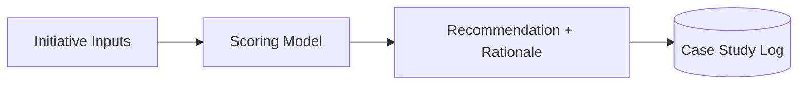

# 🧭 Compass — AI Investment Decision Tool

 

> 💡 **Leadership frameworks turned into software — not another slide deck.**



---

**AI Expert Core Tracks — Track 3 of 6: AI Leader.** The strategy/investment frameworks from *AI Leader: Generative AI & Agentic AI for Leaders & Founders* (Become an AI Strategist → Decision Maker → Leader) turned into a working decision-support tool, instead of a slide deck — the engineer's version of a leadership capstone.

## 🧩 Sub-projects
- **`framework/`** — the strategist-track investment/prioritization framework, encoded as a scoring model (not a spreadsheet only a human can run)
- **`decision-tool/`** — a small web app implementing that scoring model: input a candidate AI initiative, get a build-vs-buy-vs-skip recommendation with a documented rationale
- **`case-studies/`** — 2–3 worked examples (including the "agentic AI toolkit" you're building right now) run through the tool

## 🚀 Capstone
A lightweight app where a leader enters an AI initiative's parameters (cost, risk, team readiness, expected impact) and gets a scored, explainable recommendation — the strategist/decision-maker/leader frameworks from the course, made reusable instead of one-time.

## ⚡ Quickstart
```bash
git clone <your-fork-url> && cd compass
./scripts/setup.sh
./scripts/dev.sh
```

## 🗺️ Roadmap
- [ ] Framework encoded as a scoring model with documented weights
- [ ] Decision tool working end-to-end (input → recommendation)
- [ ] 2–3 case studies run and written up
- [ ] Tool usable by someone who didn't take the course

## 📈 At 10x Scale, I'd
Let teams calibrate the scoring weights to their own risk tolerance instead of a fixed model, log every recommendation made so the model's calibration can be audited over time, and add a "what changed my recommendation" explainer for transparency.

## 🔍 Originality vs. the Course
The course teaches the frameworks as decision material for a human to apply manually; this repo is the frameworks turned into software — the difference between understanding a leadership concept and being able to build the tool that operationalizes it.

## 📄 License
MIT – see `LICENSE`.
